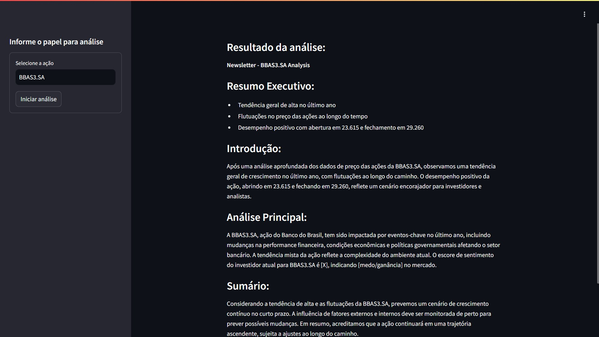

# Agentes inteligentes para análise de ações



Este repositório contém um script que utiliza uma configuração de 3 agentes inteligentes, configurados com a ferramenta [CrewAI](https://crewai.com/), para analisar ações da bolsa de valores e foi desenvolvido durante o evento **IA na Prática** promovido pela [Rocketseat](https://rocketseat.com.br/).

## Descrição do projeto

Um agente coleta a cotação de ação através da biblioteca [yfinance](https://pypi.org/project/yfinance/), equanto outro agente analise notícias relacionadas ao papel, analisando os vieses das notícias.

O terceiro agente usa como contexto as análises dos outros dois agentes para indicar as tendências relativas ao papel analisado.

> Este script consome a API da OpenAI, utilizando modelos de linguagem para as análises. Note que é necessário ter uma conta na OpenAI e uma chave de API para utilizar este script.

> Não se recomenda o uso dos relatórios gerados por este script para a tomada de decisões financeiras. Valide sempre as informações com um profissional da área.

## Configuração

Para usar este script, siga os passos abaixo:

1. Renomeie o arquivo `.env-dist` para `.env`. Este arquivo contém as variáveis de ambiente necessárias para a aplicação funcionar. Insira as informações necessárias no arquivo.
2. Para obter uma chave de API da OpenAI, acesse o [site da OpenAI](https://platform.openai.com/), crie uma conta e gere uma chave de API.
3. Recomenda-se que você crie um ambiente virtual para instalar as dependências do projeto. Para isso, execute o seguinte comando:

    ```bash
    $ python -m venv .venv
    ```

4. Ative o ambiente virtual executando o seguinte comando:

    ```bash
      $ source .venv/bin/activate
    ```

5. Instale as dependências necessárias executando o seguinte comando:

    ```bash
    $ pip install -r requirements.txt
    ```

6. Uma vez que as dependências estejam instaladas, você pode executar o script usando o seguinte comando:

    ```bash
    $ streamlit run crewai-stocks.py
    ```